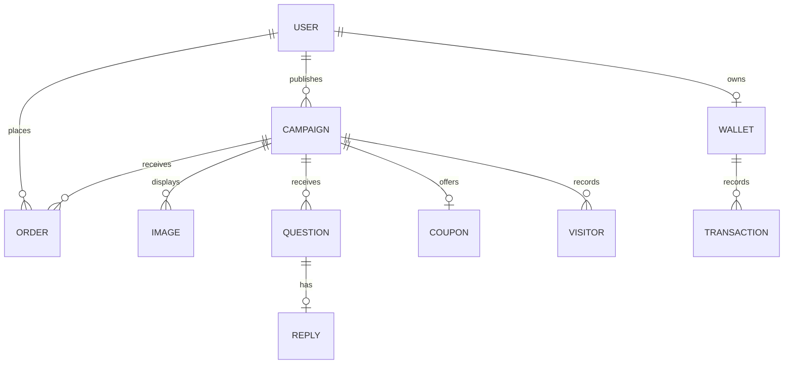

# pre.shop

`pre.shop` is a community preorder marketplace demo built with Laravel and Livewire. Members can publish small-batch campaigns, back other makers, manage orders and request payouts. Administrators get a marketplace-wide view of members, campaigns, sales, fees, wallets and withdrawal requests.

> [!IMPORTANT]
> This is a demonstration project, not a production commerce system. Checkout is simulated locally: placing an order immediately marks it paid and credits the maker's wallet. No card, FPX, payout, OAuth or other third-party service is contacted.

## What the demo includes

- Public landing page, campaign catalogue, search and campaign detail pages
- Shared member accounts: every non-admin member can both buy and publish
- Campaign creation and management with images, variations, regional shipping and coupons
- Session-backed checkout with Malaysian postcode/state detection
- Buyer order history and invoices
- Maker sales, wallet, bank details and withdrawal requests
- Admin analytics, member directory, campaign review, order ledger and withdrawal approval/rejection
- Fortify/Jetstream password, profile, browser-session and account-deletion settings
- Deterministic demo data and feature tests
- Daily campaign expiry through Laravel's scheduler

## Technology

| Area | Implementation |
| --- | --- |
| Runtime | PHP 8.3+, Laravel 13 |
| UI | Livewire 4, Blade and Alpine.js |
| Styling | Tailwind CSS 4 with custom design tokens |
| Assets | Vite 8 |
| Authentication | Laravel Jetstream, Fortify and Sanctum |
| Data | Eloquent; MySQL by default, SQLite supported |
| Tests | PHPUnit 11 and Livewire's test utilities |
| Timezone | `Asia/Kuala_Lumpur` |

The exact dependency constraints are in [`composer.json`](composer.json) and [`package.json`](package.json).

## Quick start

### Prerequisites

- PHP 8.3 or newer with Composer and the extensions required by Laravel
- A current Node.js installation with npm
- MySQL, or PHP's SQLite PDO extension for a zero-service local setup

### 1. Install dependencies and create the environment

```bash
composer install
npm ci
cp .env.example .env
php artisan key:generate
```

On PowerShell, replace the copy command with:

```powershell
Copy-Item .env.example .env
```

### 2. Configure the database

The supplied `.env.example` uses MySQL. Create a database, then set `DB_DATABASE`, `DB_USERNAME` and `DB_PASSWORD` in `.env`.

For SQLite instead, create the file:

```bash
php -r "file_exists('database/database.sqlite') || touch('database/database.sqlite');"
```

Set `DB_CONNECTION=sqlite` in `.env` and remove the `DB_DATABASE` line so Laravel uses `database/database.sqlite`.

### 3. Build the demo database and public storage link

```bash
php artisan storage:link
php artisan migrate:fresh --seed
```

`migrate:fresh` drops all application tables. Use `php artisan migrate --seed` if the configured database contains data you need to preserve.

### 4. Run the application

Start Laravel and Vite in separate terminals:

```bash
php artisan serve
```

```bash
npm run dev
```

Open [http://127.0.0.1:8000](http://127.0.0.1:8000). For a compiled frontend instead of the Vite development server, run `npm run build`.

## Demo accounts

All seeded accounts are verified and use the password `password`.

| Account | Email | Good for |
| --- | --- | --- |
| Admin | `admin@preshop.test` | Admin overview, campaigns, sales and withdrawal decisions |
| Maya Tan | `maya@preshop.test` | Active and completed campaigns, buyer history and maker wallet |
| Irfan Rahman | `irfan@preshop.test` | Active and completed campaigns, buyer history and maker wallet |
| Nadia Lim | `nadia@preshop.test` | Active and completed campaigns, buyer history and maker wallet |
| Daniel Wong | `daniel@preshop.test` | Completed campaign, buyer history and maker wallet |
| Sofia Lee | `sofia@preshop.test` | Completed campaign, buyer history and maker wallet |

Registration is intentionally disabled. `/register` redirects to the landing page, so use one of the seeded accounts.

The deterministic seed contains 6 users, 8 campaigns, 14 delivered orders, 5 wallets and 8 visitor records. Three campaigns are live. Their coupon code is `BACK10` for a 10% discount.

## Suggested demo journeys

### Back a campaign

1. Browse `/shop` or select a campaign on the landing page.
2. Sign in as any member.
3. Choose an option and quantity, then select **Preorder**.
4. Enter a Malaysian delivery address; a known postcode selects its state and shipping zone.
5. Optionally apply `BACK10`, then place the order.
6. Open the generated invoice or view it later under `/past-orders`.

### Act as a maker

1. Sign in as Maya or Irfan.
2. Use `/campaigns/create` to publish a campaign with up to five images.
3. Use `/campaigns` to edit campaign copy, shipping, variations, images, questions and coupons.
4. Review buyer activity at `/my-sales`.
5. Add demo bank details and request at least RM50 from `/payouts`.

### Review the marketplace

1. Sign in as `admin@preshop.test`.
2. Review marketplace totals and recent activity at `/admin/overview`.
3. Inspect users, campaigns and orders.
4. Approve or reject pending withdrawals at `/admin/wallets`. Rejection returns the reserved amount to the maker's available balance.

## Application architecture

Most pages are routeable Livewire components. They own interaction and validation, render a paired Blade view and query Eloquent models directly. This is deliberate for the scale of the demo; there is no service or repository layer.

```text
Browser
  -> routes/web.php
  -> route middleware (auth, verified, admin)
  -> app/Livewire/* component
  -> app/Models/* via Eloquent
  -> database
  -> resources/views/livewire/* Blade view
```

### Main directories

| Path | Purpose |
| --- | --- |
| `app/Livewire/Customer` | Shop, campaign detail, checkout, invoices and order history |
| `app/Livewire/Business` | Campaign publishing/management, sales and payouts |
| `app/Livewire/Admin` | Admin analytics and operational tables |
| `app/Livewire/User` | Shared member dashboard |
| `app/Models` | Eloquent models and relationships |
| `app/Http/Middleware` | Authentication and admin access enforcement |
| `database/migrations` | Database schema history |
| `database/seeders` | Canonical deterministic demo dataset |
| `resources/views` | Layouts, Blade components and Livewire views |
| `resources/css/app.css` | Tailwind imports, tokens and reusable visual classes |
| `resources/js` | Vite entry point and progressive motion modules |
| `public/asset/product` | Source product images used by the demo seeder |
| `tests/Feature` | Authentication, marketplace, admin and Jetstream behaviour |

### Core data relationships



All monetary values are integer Malaysian sen. For example, `4800` is displayed as RM48.00. Campaign creation adds a 3% platform fee to the entered base price and stores both the displayed price and fee. Avoid floating-point storage or formatting money before persistence.

### Status values

| Entity | Value | Meaning |
| --- | ---: | --- |
| Campaign | `1` | Live |
| Campaign | `2` | Ended |
| Order | `0` | Pending |
| Order | `1` | Paid |
| Order | `2` | Shipped |
| Order | `3` | Delivered |
| Wallet | `1` | Active |
| Wallet | `2` | Withdrawal pending |
| Transaction | `1` | Income credited |
| Transaction | `2` | Withdrawal approved |
| Transaction | `3` | Withdrawal pending |
| Transaction | `4` | Withdrawal rejected |

## Important flows

### Checkout and wallet credit

The campaign page stores `campaign_id`, quantity and selected variations in the session. The authenticated `/payment` page calculates shipping from the configured Malaysian state zones, validates the optional coupon and creates the order inside a database transaction. The new order is immediately paid. In that same transaction the coupon usage is incremented and the campaign owner's wallet receives `order amount - campaign fee`.

Submitting the same checkout twice does not create a second order because the preorder session is removed after success. Feature coverage for this flow lives in `tests/Feature/MarketplaceTest.php`.

### Withdrawals

A maker saves bank details and requests an amount of at least RM50. The requested amount is removed from the available balance and recorded as pending. An admin decision is handled in a locked database transaction. Approval finalizes the request; rejection returns the reserved funds. Repeated admin actions are safe no-ops.

### Campaign lifecycle

The scheduler runs `update_campaign_status` daily in `Asia/Kuala_Lumpur`. It changes expired live campaigns to ended and changes their orders to shipped.

Run the scheduler locally with:

```bash
php artisan schedule:work
```

In a deployed environment, invoke `php artisan schedule:run` every minute using the platform scheduler or cron.

## Routes and access

| Access | Routes | Notes |
| --- | --- | --- |
| Public | `/`, `/shop`, `/{campaign}` | Campaign binding uses the slug; the catch-all route is deliberately last |
| Guest auth | `/login` and password reset routes | Supplied by Fortify |
| Verified member | `/dashboard`, `/campaigns*`, `/my-sales`, `/payouts`, `/payment`, `/order/{order}`, `/past-orders` | All members can buy and publish |
| Admin | `/admin/overview`, `/admin/users`, `/admin/campaigns*`, `/admin/sales`, `/admin/wallets` | Requires `is_admin = true` |
| Token API | `/api/user` | Requires Sanctum authentication |

Campaign management checks ownership in addition to route authentication. Invoices are visible only to the buyer, campaign owner or an admin.

For the generated route table:

```bash
php artisan route:list --except-vendor
```

## Development commands

| Command | Purpose |
| --- | --- |
| `php artisan test` | Run the complete PHPUnit suite using in-memory SQLite |
| `php artisan test --filter=MarketplaceTest` | Run the main marketplace scenarios |
| `php artisan test --filter=AdminOperationsTest` | Run admin and wallet transition scenarios |
| `vendor/bin/pint --test` | Check PHP formatting without changing files |
| `vendor/bin/pint` | Format PHP files |
| `npm run dev` | Start Vite with hot reload |
| `npm run build` | Produce a production frontend build |
| `php artisan migrate:fresh --seed` | Recreate the deterministic demo database; destructive |
| `php artisan storage:link` | Expose campaign uploads under `/storage` |
| `php artisan optimize:clear` | Clear stale Laravel caches during troubleshooting |

There is no JavaScript unit-test or lint script in `package.json`; the frontend verification step is `npm run build` plus browser smoke testing.

## Testing

`phpunit.xml` forces an in-memory SQLite database, array cache and session drivers, synchronous queues and an in-memory mailer. Tests never need the local database configured in `.env`.

Before handing off a change, run:

```bash
php artisan test
npm run build
```

For schema or seed changes, also run the destructive reset against a disposable local database:

```bash
php artisan migrate:fresh --seed
```

The project-specific contributor rules and change checklist are in [`AGENTS.md`](AGENTS.md).

## Configuration and storage

- Application timezone is fixed to `Asia/Kuala_Lumpur` in `config/app.php`.
- Malaysian state and postcode ranges are in `config/countries.php`.
- Campaign images use the `public` filesystem disk and are stored under `storage/app/public/campaign`.
- `php artisan storage:link` maps that directory to `public/storage`.
- Uploaded campaign images accept common image files up to 4 MB each; publishing accepts at most five.
- `.env` is local-only and ignored by Git. Do not commit credentials or production configuration.

## Demo boundaries

- Checkout does not contact a payment processor and must not be described as collecting real payment.
- Withdrawals are ledger transitions only; no bank transfer is initiated.
- Registration is disabled to keep the demo dataset controlled.
- Mail, queues and broadcasting retain Laravel configuration but are not required for the core journey.
- Uploaded files use local storage; there is no cloud media pipeline.
- The application is not hardened, audited or operationally configured for real customer or financial data.
- API-token management, email verification and 2FA are present in inherited framework code/tests but disabled in the current configuration.

## Troubleshooting

### `No application encryption key has been specified`

Run `php artisan key:generate` after creating `.env`.

### Database or session table errors

Verify the `DB_*` values, then run `php artisan migrate`. The default `SESSION_DRIVER=database` requires the `sessions` migration.

### Campaign images are missing

Run `php artisan storage:link`. If seeded images are absent, make sure the source files remain in `public/asset/product`, then rerun `php artisan migrate:fresh --seed` on a disposable database.

### Vite manifest or connection errors

Run `npm ci`, then either keep `npm run dev` running or create the manifest with `npm run build`.

### Old routes, views or configuration appear to persist

Run `php artisan optimize:clear` and refresh the page.
